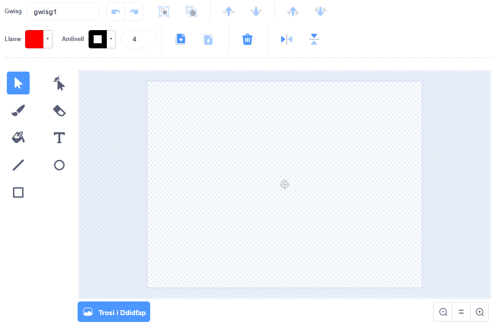

- Clicia **Paentio** ar y ddewislen **Dewiswch Gorlun** i **Baentio corlun newydd**.

- Defnyddia'r offeryn arlunio yn y tab **Gwisgoedd** i beintio dy gorlun newydd.

- Ar ôl i ti orffen, paid ag anghofio rhoi enw synhwyrol i dy gorlun newydd.