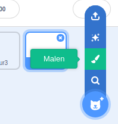
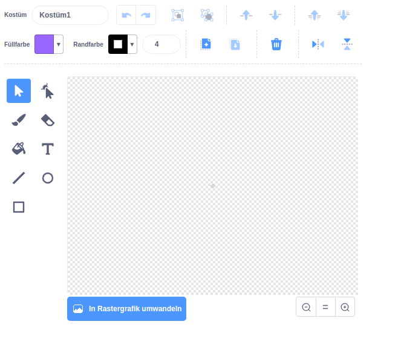

- Klicke auf **Malen** im **Figur wählen** Menü um **eine neue Figur** zu zeichnen.

- Verwende die Zeichenwerkzeuge auf der Registerkarte **Kostüme**, um dein neues Sprite zu zeichnen.

- Vergiss nicht, deiner neuen Figur einen vernünftigen Namen zu geben.