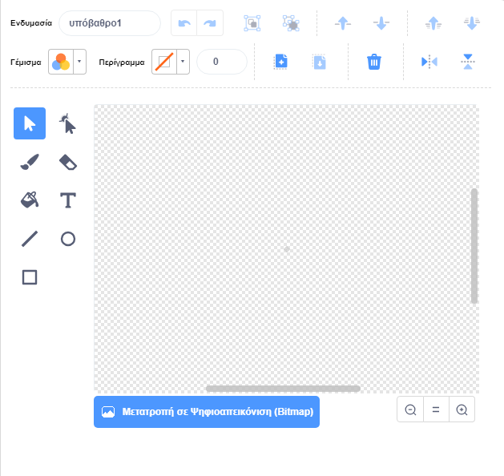

- Click **Paint** on the **Choose a Sprite** menu to **Paint new sprite**.

- Use the drawing tool in the **Costumes** tab to paint your new sprite.

- When you are finished, don't forget to give your new sprite a sensible name.