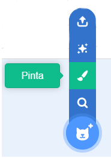
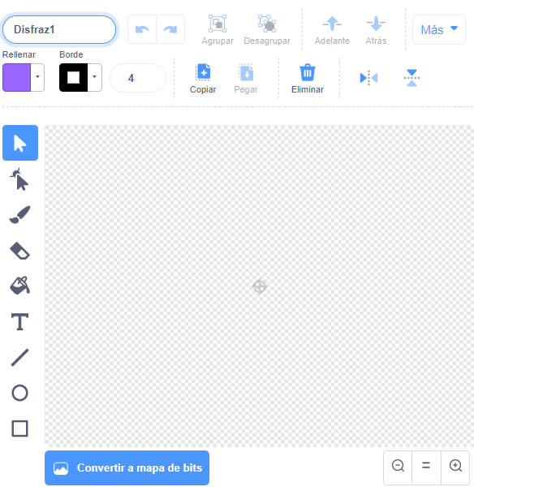

- Haz clic en **Pinta** en el menú **Elige un objeto** para **Pintar un nuevo objeto**.

- Usa la herramienta de dibujo en la pestaña **Disfraces** para pintar tu nuevo objeto.

- Cuando hayas terminado, no olvides dar un nombre adecuado a tu nuevo objeto.