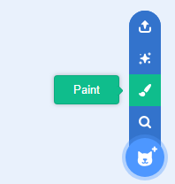

- برای **کشیدن یک شبح جدید**، در منوی **Choose a Sprite** بر روی **Paint** کلیک کنید.

- با استفاده از ابزار طراحی در قسمت **Costumes** شبح جدید خود را نقاشی کنید.

- هنگامی که کار شما به پایان رسید، فراموش نکنید که برای شبح جدید خود، یک نام مناسب بگذارید.