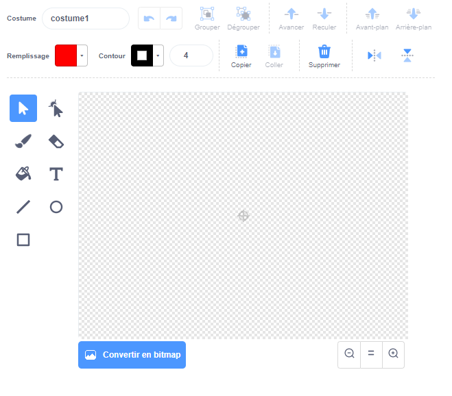

- Clique sur **Peindre** dans le menu **Choisir un Sprite** pour **Peindre un nouveau sprite**.

- Utilise l'outil de dessin dans l'onglet **Costumes** pour peindre ton nouveau sprite.

- Quand tu as terminé, n'oublie pas de donner un nom à ton nouveau sprite.