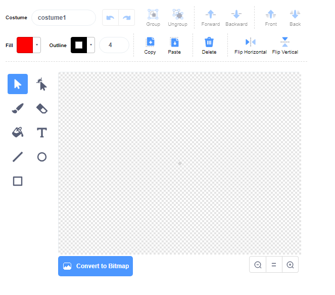

- **नयी स्प्राइट पेंट** करने के लिए **Choose a Sprite** मेन्यू में **Paint** पर क्लिक करें।

- अपने नए स्प्राइट को पेंट करने के लिए **Costumes** टैब में ड्राइंग टूल का उपयोग करें ।

- जब आप समाप्त कर लें, तो अपने नए स्प्राइट को कोई उचित नाम देना न भूलें।