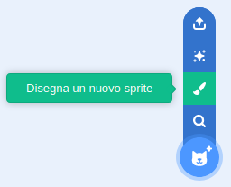

- Fai clic su **Disegna un nuovo sprite** dal menu **Scegli uno Sprite** per **Disegnare un nuovo sprite**.

- Usa lo strumento di disegno nella scheda **Costumi** per disegnare il tuo nuovo sprite.

- Quando hai finito, non dimenticare di dare al tuo nuovo sprite un nome significativo.