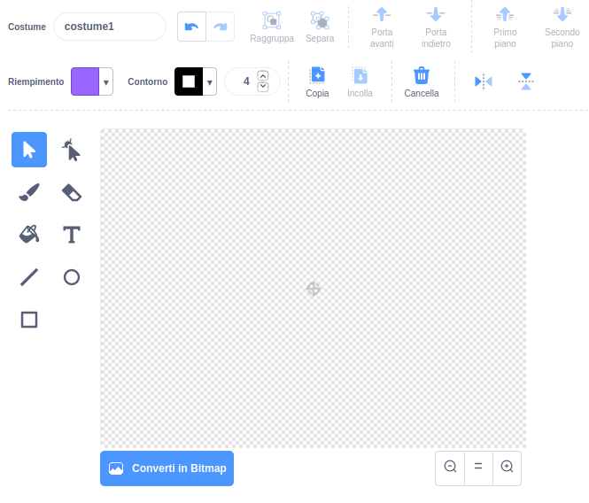

- Fai clic su **Disegna un nuovo costume** dal menu **Scegli uno Costume** per **Disegnare un nuovo costume**.

- Usa lo strumento di disegno nella scheda **Costumi** per disegnare il tuo nuovo sprite.

- Quando hai finito, non dimenticare di dare al tuo nuovo sprite un nome significativo.