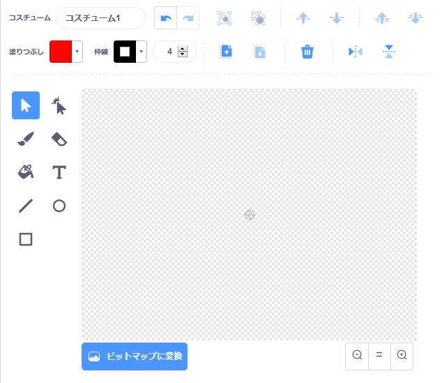

- **コスチュームを選ぶ** (えらぶ) メニューから**描く** をクリックし、**新しいスプライトを描きます** 。

- Use the drawing tool in the **Costumes** tab to paint your new sprite.

- When you are finished, don't forget to give your new sprite a sensible name.