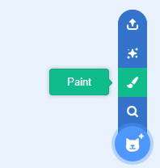
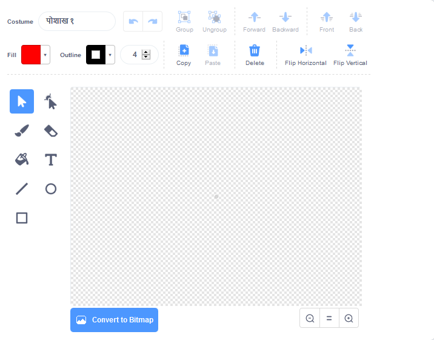

- **नवीन स्प्राईटला पेंट करण्यासाठी** **निवडा स्प्राईट** मेनू मध्ये **पेंट** वर क्लिक करा.

- आपल्या नवीन स्प्राईट रंगविण्यासाठी **कॉक्स्यूम्स** टॅबमध्ये ड्रॉईंग टूल वापरा.

- जेव्हा आपण संपवाल तेव्हा आपले नवीन स्प्राईटला एक समझदार नाव देण्यास विसरू नका.