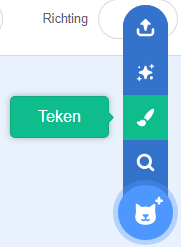
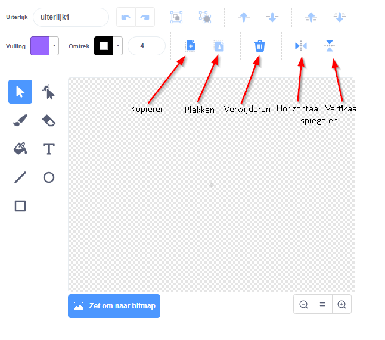

- Klik op **Teken** in het **Kies een Sprite** menu om **een nieuwe sprite te tekenen**.

- Gebruik het tekengereedschap in het tabblad **Kostuums** om je nieuwe sprite te tekenen.

- Als je klaar bent vergeet dan niet om je nieuwe sprite een verstandige naam te geven.