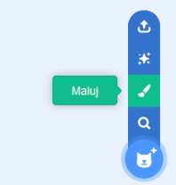
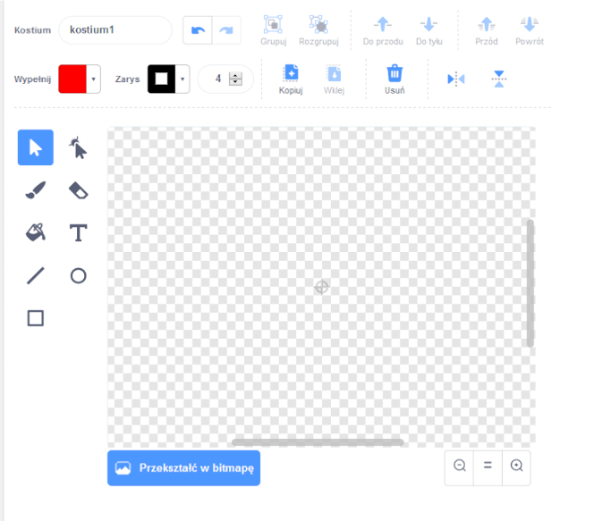

- Kliknij **Maluj** na menu **Wybierz duszka** aby**Namalować nowego duszka**.

- Użyj narzędzia do rysowania w zakładce **Kostiumy** do malowania nowego duszka.

- Kiedy skończysz, nie zapomnij nadać swojemu nowemu duszkowi rozsądnej nazwy.