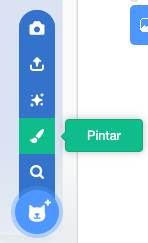

- Clique **Pintar** no menu **Escolher Fantasia** para **Pintar novo ator**.

- Use a ferramenta de desenho na aba **Fantasias** para pintar seu novo ator.

- Quando terminar, não se esqueça de dar um bom nome ao seu novo ator.