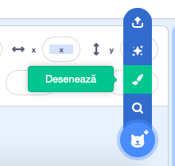
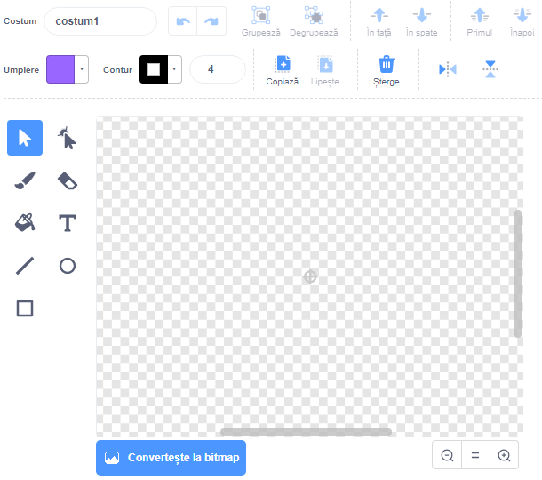

- Dă click pe **Desenează** din meniul **Alege un Personaj** pentru a **desena un personaj nou**.

- Folosește instrumentul de desenat din tab-ul **Costume** pentru a desena noul tău personaj.

- După ce ai terminat, nu uita să dai un nume potrivit noului tău personaj.