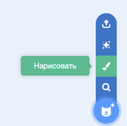
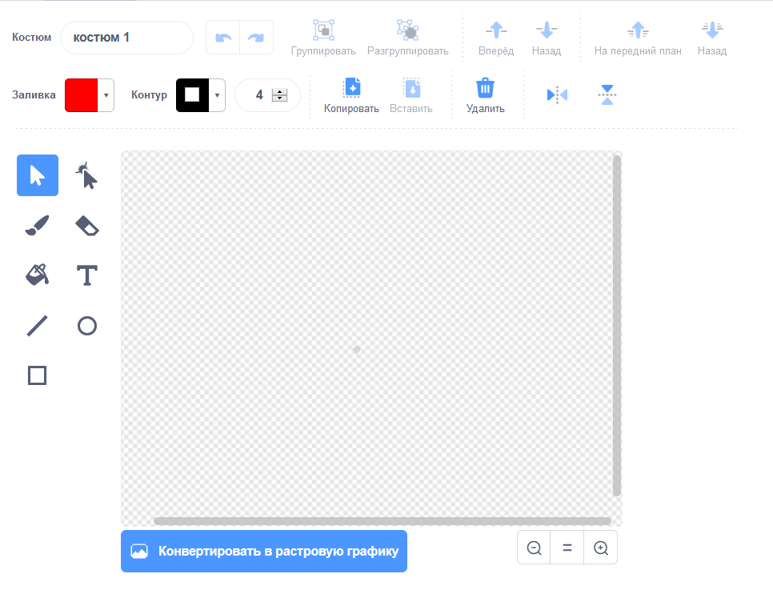

- Нажми **Нарисовать** в меню **Выбрать спрайт** для того, чтобы **Нарисовать новый спрайт**.

- Используй инструмент рисования из вкладки **Костюмы**, чтобы нарисовать свой новый спрайт.

- Когда ты закончишь, не забудь дать твоему новому спрайту понятное имя.