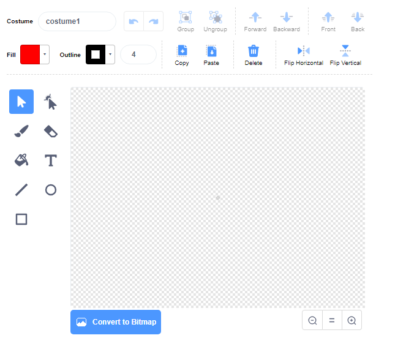

- **sprite එකක් තෝරන්න(choose a sprite)** මෙනුවේ ඇති **පින්තාරුව(paint)** මත ක්ලික් කර **නව sprite ව පින්තාරු කිරීම(Paint new sprite)** කලහැක.

- **ඇඳුම්(Costume)** පටිත්තේ(tab) ඇති ඇඳීම්(drawing) මෙවලම්(tools) භාවිතා කර ඔබේ නව sprite එක පින්තාරු(paint) කරගන්න.

- ඔබ අවසන් වූ පසු, ඔබගේ නව sprite එකට හොඳ නමක් ලබාදීමට අමතක නොකරන්න.