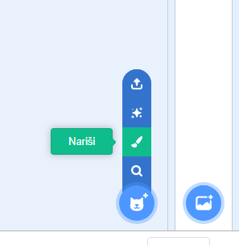
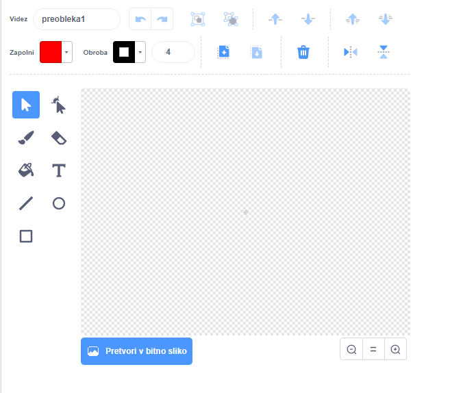

- Klikni na **Nariši** v meniju **Izberi figuro**, da **narišeš novo figuro**.

- Uporabi orodje za risanje na zavihku **Videzi**, da narišeš svojo novo figuro.

- Ne pozabi dati svoji figuri smiselno ime, potem ko končaš.