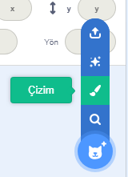

- **Yeni bir kukla çizmek** için **Bir Kukla Seç** düğmesi üzerine gelip, açılan listeden **Çizim** seçeneği tıklanır.

- Yeni kuklanızı boyamak için **Dekorlar** sekmesindeki çizim aracını kullanın.

- Bitirdiğinizde, yeni kuklanıza anlamlı bir isim vermeyi unutmayın.