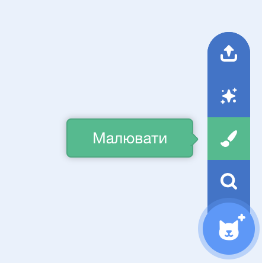
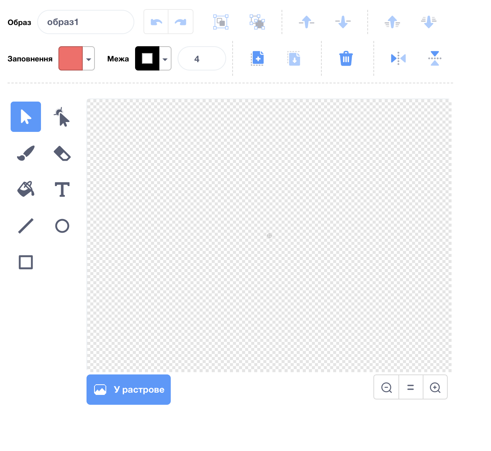

- Клацни **Малювати** в меню **Обрати спрайт**, щоб **Намалювати новий спрайт**.

- Використовуй інструменти на вкладці **Образи**, щоб намалювати твій новий спрайт.

- Коли ти закінчиш, не забудь надати своєму спрайту логічне ім’я.